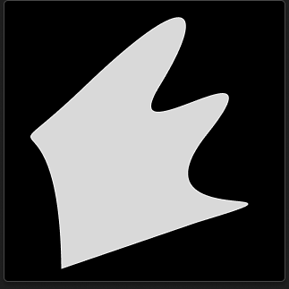
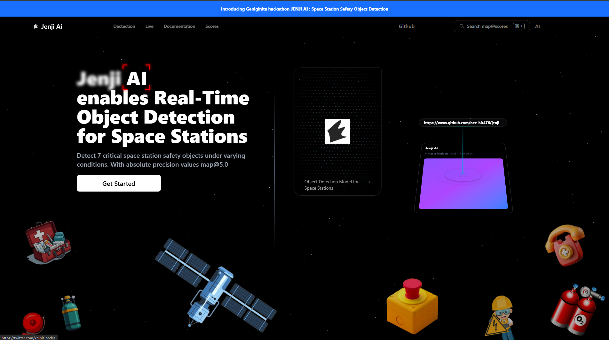
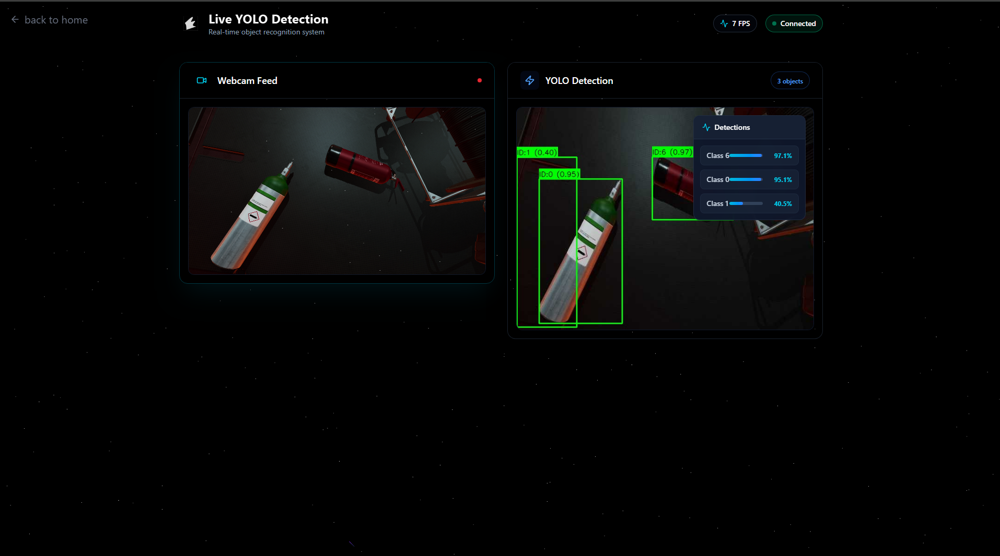
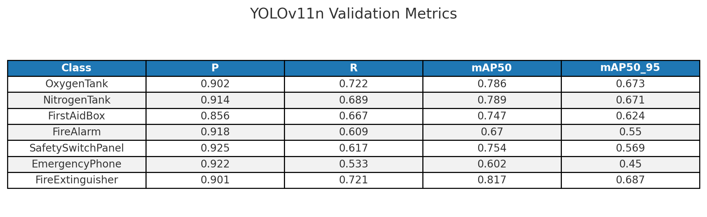
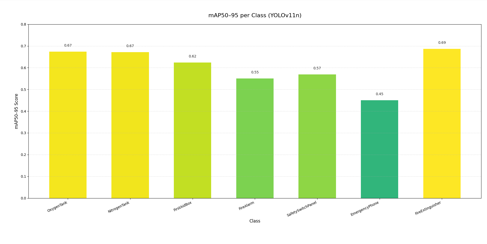

<p align="center">
  
</p>

<h1 align="center">Jenji — Space Station Safety Object Detection</h1>

<p align="center">
  <strong>Jenji</strong> is a real-time object detection application built to detect critical safety objects on a space station using <strong>YOLOv11</strong>. It leverages <strong>Python, Flask-SocketIO, OpenCV, and React</strong> to stream and annotate live webcam feeds, with a WebView desktop launcher for easy deployment.
</p>

<p align="center">
  <a href="https://github.com/nee-hit476/Jenji/tree/master">
    
  </a>
  <a href="https://github.com/nee-hit476/Jenji/stargazers">
    
  </a>
  <a href="https://github.com/nee-hit476/Jenji/network/members">
    
  </a>
</p>

##  Jenji AI Glimpse

<p align="center">
  
</p>

<p align="center">
  
</p>


##  Jenji AI Scores

<p align="center">
  
</p>

<p align="center">
  
</p>


##  Jenji AI Project Structure

```
Jenji/
├─ .vscode/                    # VS Code configuration
├─ assets/                     # Project assets (images, logos)
├─ dataset/                    # YOLO dataset
│  └─ data.yaml               # YOLO dataset config
├─ ENV_SETUP/                  # Files for setting up conda environment
├─ runs/                       # Training outputs (weights, logs)
├─ runs_test/                  # Examine folder independent of project
├─ src/                        # Source code
│  ├─ training/
│  │  ├─ train.py             # Training script
│  │  ├─ eval.py              # Evaluation script
│  │  └─ config.yaml          # YOLO config
│  ├─ api/
│  │  ├─ app.py               # Optional REST API for image upload
│  │  ├─ config.py            # Configuration settings
│  │  ├─ detection_service.py # Detection service logic
│  │  ├─ detection_visualizer.py # Visualization utilities
│  │  ├─ image_processor.py   # Image processing utilities
│  │  ├─ socket_handlers.py   # WebSocket handlers
│  │  ├─ live_app.py          # Flask + SocketIO for live detection
│  │  └─ model_loader.py      # YOLO model loader
│  ├─ utils/
│  │  ├─ metrics.py           # Evaluation metrics
│  │  └─ viz.py               # Visualization utilities
│  ├─ frontend/                # React frontend
│  │  ├─ package.json
│  │  └─ src/
│  │     ├─ App.tsx
│  │     └─ index.tsx
│  └─ launcher/
│     └─ launch_app.py        # WebView-based desktop launcher
├─ .dockerignore               # Docker ignore file
├─ .gitignore                  # Git ignore file
├─ compose.yaml                # Docker Compose configuration
├─ Dockerfile                  # Docker container configuration
├─ download_dataset.ps1        # PowerShell script to download dataset
├─ environment.yaml            # Conda environment specification
├─ Makefile                    # Build automation
├─ plot.py                     # Plotting utilities
├─ README.Docker.md            # Docker-specific documentation
├─ README.md                   # Main documentation
└─ yolo11n.pt                  # Pre-trained YOLO11 model weights
```


## 🎯 Hackathon Objective

Detect 7 critical **space station safety objects** under varying conditions:
- `OxygenTank`
- `NitrogenTank`
- `FirstAidBox`
- `FireAlarm`
- `SafetySwitchPanel`
- `EmergencyPhone`
- `FireExtinguisher`

**Key Goals:**
- Train a **robust YOLO model** on synthetic data from Duality AI's Falcon simulator
- Evaluate model performance using **mAP@0.5, Precision, Recall, and Confusion Matrices**
- **(Bonus)** Create a desktop or mobile app to use the trained model live


## 🚀 Quick Start

```bash
./download_dataset.ps1
make train
make run 
```

### Frontend 
```bash
make install-client
make client
```

### Backend
```bash
make backend # after dataset downloaded and model train
```

## ⚙️ Setup Instructions

### 1. Clone Repository

```bash
git clone https://github.com/nee-hit476/Jenji.git
cd Jenji
```

### 2. Set up Python Environment

```bash
# Using conda
conda env create -f environment.yml
conda activate jenji
```

**Dependencies include:**
`torch`, `opencv-python`, `flask`, `flask-socketio`, `numpy`, `webview`, `socketio-client`, etc

### 3. Download Dataset

**Ensure dataset/ contains**: 
- `train/`, `val/`, `test/` folders
- YOLO-compatible `.txt` labels
- `data.yaml` describing class names and dataset paths
- Run `download_dataset.ps1`

### 4. Train YOLO Model

```bash
cd src/training
python train.py --cfg config.yaml --data ../dataset/data.yaml --epochs 50 --batch-size 16
```

**Outputs:**
- Trained weights in `runs/yolov11_experiment_x/weights/`
- Logs and metrics in `runs/yolov11_experiment_x/`

### 5. Evaluate Model Performance

```bash
python eval.py --weights ../runs/yolov11_experiment_x/weights/best.pt --data ../dataset/data.yaml
```

**Generates:**
- mAP@0.5 scores
- Confusion matrices
- Precision/Recall metrics

### 6. Run Flask-SocketIO Live Detection

```bash
cd src
python launcher/launch_app.py
```

- Opens WebView desktop window pointing to frontend `http://localhost:5173`
- Streams webcam frames to Flask server
- Returns annotated frames in real-time

### 7. Frontend Setup (React)

```bash
cd src/frontend
npm install
npm run dev
```

- Ensure the frontend dev server is running on `http://localhost:5173`
- Displays live annotated video frames from YOLO

### 8. Using the App

1. Allow camera permissions
2. Wait for the live feed
3. YOLO detects objects and overlays bounding boxes:
    - **Green box** = detected object
    - **Label** = class name + confidence


## 🐛 Debugging and Issues Faced

| Issue              | Fix                                                           |
| ------------------ | ------------------------------------------------------------- |
| Webcam not working | Check browser permissions; close other apps using webcam      |
| WebSocket errors   | Ensure backend is running on `http://localhost:8000`          |
| No detections      | Check `MODEL_PATH` in `model_loader.py`; verify weights exist |
| Slow training      | Reduce batch size; monitor GPU usage with `nvidia-smi`        |

---

## 📝 License

This project was created for a hackathon. Please check the repository for license details.


## 🤝 Contributing

Contributions, issues, and feature requests are welcome!

---

<p align="center">Made with ❤️ for Space Station Safety</p>